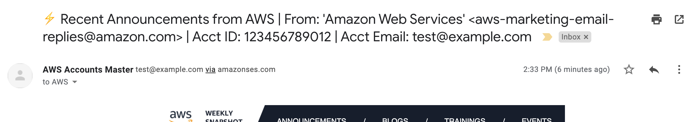
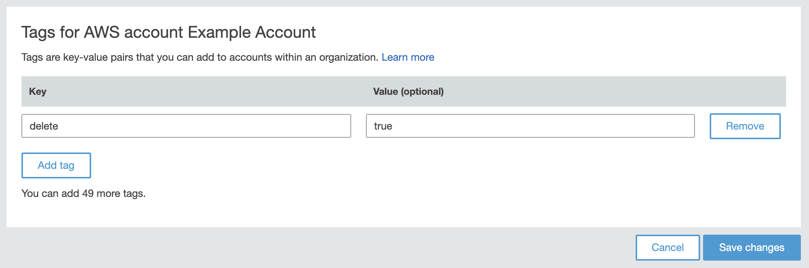

# AWS Account Controller

> Manage the creation and deletion of sandbox-style accounts.

> :exclamation: **PLEASE READ [THE CAVEATS](https://onecloudplease.com/blog/automating-aws-account-deletion) OF THIS SOLUTION BEFORE CONTINUING**

## Prerequisites

The following is required before proceeding:

* An AWS master account that has Organizations enabled
* A registered domain name or subdomain, which is publicly accessible
* A credit card which will be used to apply payment information to terminated accounts
* A [2captcha](https://2captcha.com/) account that is sufficiently topped-up with credit ($10 would be more than enough)
* A preferred master e-mail address to receive account correspondence to

## Installation

Click the above link to deploy the stack to your environment. This stack creates:

* Optionally, a Route 53 hosted zone (or provide your own by zone ID)
* An MX record to SES inbound in the hosted zone
* An event rule that triggers Lambda execution when an organizations account is tagged
* Node.js Lambda Function, used for all actions performed, with appropriate permissions
* Log group for the Lambda Function, with a short term expiry
* An S3 bucket for debugging screenshots, with a short term expiry
* An S3 bucket for storing raw e-mail content, with a short term expiry
* An SES Receipt Rule Set, which is automatically promoted to be default
* An IAM user with a login profile, used to deploy a Connect instance

If you prefer, you can also manually upsert the [template.yml](https://github.com/iann0036/aws-account-controller/blob/master/template.yml) stack from source.

If you chose to have the stack create a hosted zone for the account root e-mails instead of you bringing your own, you should ensure the nameservers of the new zone are associated with an accessible domains (automatic if the domain was created within Route 53).

You should also ensure that SES verifies the master e-mail address as it is used for sending and either verifies the destination domain or is released from sandbox mode. Also make sure SES sending service limits are appropriate for the amount of e-mails you intend to receive.

Currently, the only tested region is `us-east-1`. The stack deploy time is approximately 8 minutes.

#### Uninstallation

To remove this solution, ensure that both S3 buckets have their objects removed then delete the CloudFormation stack. The SES Receipt Rule Set will revert back to `default-rule-set`. An attempt will be made to terminate the Connect instance, however you should verify this occurs.

## Usage

In order for you to easily build upon this system, the system makes heavy use of tags for system automation and configuration.

### E-mail Forwarding

E-mails that are targetting the addresses of the root account will be forwarded by default to the master e-mail address.

You can specify a different destination per account by placing a tag with the key `AccountEmailForwardingAddress` on the account in Organizations.

You can also override the format of the subject line for forwarded e-mails. During installation, you can change the subject line to any string with the following variables available for substitution:

* {from} - The From address of the original e-mail
* {to} - The To address of the original e-mail
* {subject} - The subject of the original e-mail
* {accountid} - The ID of the account
* {accountname} - The name of the account
* {accountemail} - The root email address of the account

### Account Deletion

In order to elect to delete an account, simply tag an account within the Organizations console with the following:

*Tag Key:* **delete**

*Tag Value:* **true**

Once tagged, a process will perform the following actions on your behalf:

* Trigger a password reset for the root account
* Reset the password to the automatically generated master password
* Add payment information to the account
* Perform a phone verification of the account
* Close the account
* Remove (or schedule removal of) the account from Organizations

The above process takes approximately 4 minutes.

If the account more than 7 days old, the process completely remove the account from Organizations. If the account is less than 7 days old, a tag with the key `AccountDeletionTime` will be set with the timestamp the account was deleted at and another tag with the key `ScheduledRemovalTime` will be set with the timestamp the account will be removed from Organizations.
