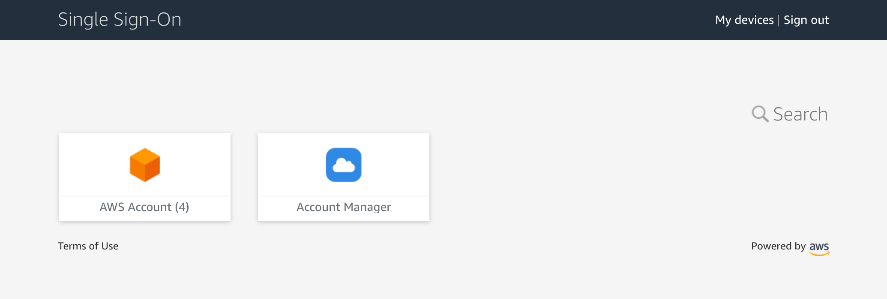

# AWS Account Controller

## Update March 2022: This is now largely deprecated due to the [CloseAccount](https://docs.aws.amazon.com/organizations/latest/APIReference/API_CloseAccount.html) method

> Self-service creation and deletion of sandbox-style accounts

> :exclamation: **PLEASE READ [THE CAVEATS](https://onecloudplease.com/blog/automating-aws-account-deletion) OF THIS SOLUTION BEFORE CONTINUING**

## Prerequisites

The following is required before proceeding:

* An AWS master account that has Organizations and SSO enabled
* A credit card which will be used to apply payment information to terminated accounts (reloadable debit cards work also)
* A [2Captcha](https://2captcha.com/) account that is sufficiently topped-up with credit ($10 would be more than enough)
* A preferred master e-mail address to receive account correspondence to
* A registered domain name or subdomain, which is publicly accessible
* SES to have the master e-mail address be verified
* SES to have either have the domain/subdomain also verified or have SES out of sandbox mode

## Installation

Click the above link to deploy the stack to your environment. This stack creates:

* Optionally, a Route 53 hosted zone (or provide your own by zone ID)
* An MX record to SES inbound in the hosted zone
* Node.js Lambda Function, used for all actions performed, with appropriate permissions
* Log group for the Lambda Function, with a short term expiry
* An S3 bucket for debugging screenshots, with a short term expiry
* An S3 bucket for storing raw e-mail content, with a short term expiry
* An SES Receipt Rule Set, which is automatically promoted to be default
* An event rule that triggers Lambda execution when an organizations account is tagged for deletion (if enabled)
* An API Gateway to service the SSO Account Manager application (if enabled)
* An IAM user with a login profile, used to deploy a Connect instance and register the SSO application

If you prefer, you can also manually upsert the [template.yml](https://github.com/iann0036/aws-account-controller/blob/master/template.yml) stack from source.

If you chose to have the stack create a hosted zone for the account root e-mails instead of you bringing your own, you should ensure the nameservers of the new zone are associated with an accessible domains (automatic if the domain was created within Route 53).

Also make sure SES sending service limits are appropriate for the amount of e-mails you intend to receive.

Currently, the only tested region is `us-east-1`. The stack deploy time is approximately 8 minutes.

#### Uninstallation

To remove this solution, ensure that both S3 buckets have their objects removed then delete the CloudFormation stack. The SES Receipt Rule Set will revert back to `default-rule-set`. An attempt will be made to terminate the Connect instance, however you should verify this occurs.

## Usage

In order for you to easily build upon this system, the system makes heavy use of tags for system automation and configuration.

### SSO Account Manager

The account manager (as seen at the top of this page) is a custom application that SSO users can access to create accounts or delete previously created accounts on-demand. It will be available to any user who is in the `AccountManagerUsers` SSO group. The application is accessible via the users SSO dashboard:

The application will ensure only accounts owned by the creator are shown, unless the creator explicitly shares the account with other users, in which case it will be shared with all users who are also in the `AccountManagerUsers` SSO group. Accounts which are created can optionally require a monthly budget to be set, which if exceeded will automatically trigger a deletion of the account (the maximum budget is an option during installation). Note that actual account spend may exceed the budget as pricing metrics can be delayed up to 6 hours or more for some services.

During installation, if you select `true` for the `Deny Subscription Calls` parameter, a number of calls will be denied to created accounts via an SCP such as calls to create reserved instances, register domain names or apply S3 object locks.

You can also elect not to include the SSO functionality by selecting `false` during installation for the `Enable Account Creation Functionality` parameter. You do not require SSO to be enabled within the account if you select this option.

### E-mail Forwarding

E-mails that are targetting the addresses of the root account will be forwarded by default to the master e-mail address.

You can specify a different destination per account by placing a tag with the key `AccountEmailForwardingAddress` on the account in Organizations. This is set to the SSO user automatically if the account was created with the SSO Account Manager application and the `Send Root E-mails to User` parameter was set to `true` during installation.

You can also override the format of the subject line for forwarded e-mails. During installation, you can change the subject line to any string with the following variables available for substitution:

* {from} - The From address of the original e-mail
* {to} - The To address of the original e-mail
* {subject} - The subject of the original e-mail
* {accountid} - The ID of the account
* {accountname} - The name of the account
* {accountemail} - The root email address of the account

### Account Deletion (Manual Method)

In order to elect to delete an account without the use of the SSO Account Manager, simply tag an account within the Organizations console with the following (case not sensitive):

*Tag Key:* **Delete**

*Tag Value:* **true**

Once tagged, a process will perform the following actions on your behalf:

* Trigger a password reset for the root account
* Reset the password to the automatically generated master password
* Add payment information to the account
* Perform a phone verification of the account
* Close the account
* Remove (or schedule removal of) the account from Organizations

The above process takes approximately 4 minutes.

If the account more than 7 days old, the process completely remove the account from Organizations. If the account is less than 7 days old, a tag with the key `AccountDeletionTime` will be set with the timestamp the account was deleted at and another tag with the key `ScheduledRemovalTime` will be set with the timestamp the account will be removed from Organizations.

You can also elect not to include the deletion functionality by selecting `false` during installation to the `Enable Account Deletion Functionality` parameter.

### Other Features / Options

There are some other features and options that may be specified during installation. These include:

* `Unsubscribe Marketing E-mails` - if set to `true`, newly created accounts will be unsubscribed from all AWS marketing material
* `SSO Account Manager Application Name` - sets a custom name for the SSO Account Manager
* `Automation IAM User Username` - sets a custom username for the IAM user used to perform Connect and/or SSO functions
* `Maximum Monthly Spend Per Account` - enforces a custom upper limit on the monthly budget new accounts can request, or disables budgets completely
* `Deny Subscription Calls` - if set to `true`, a service control policy which restricts the use of subscription-based calls, like reserved instances, will be applied to new accounts
* `Control Tower Mode` - if set to `true`, accounts will be created with the Control Tower Account Factory, rather than via Organizations directly

## Architecture

## Disclaimer

Per the original [post](https://onecloudplease.com/blog/automating-aws-account-deletion), I highly recommend you do not use this in an organization that has production workloads associated with it. It is intended for [developer accounts](https://youtu.be/Fxkbz0OwPKk?t=475) only.
